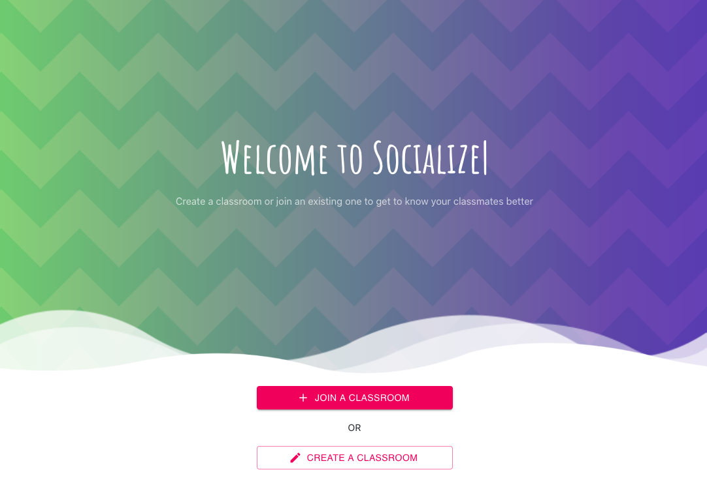
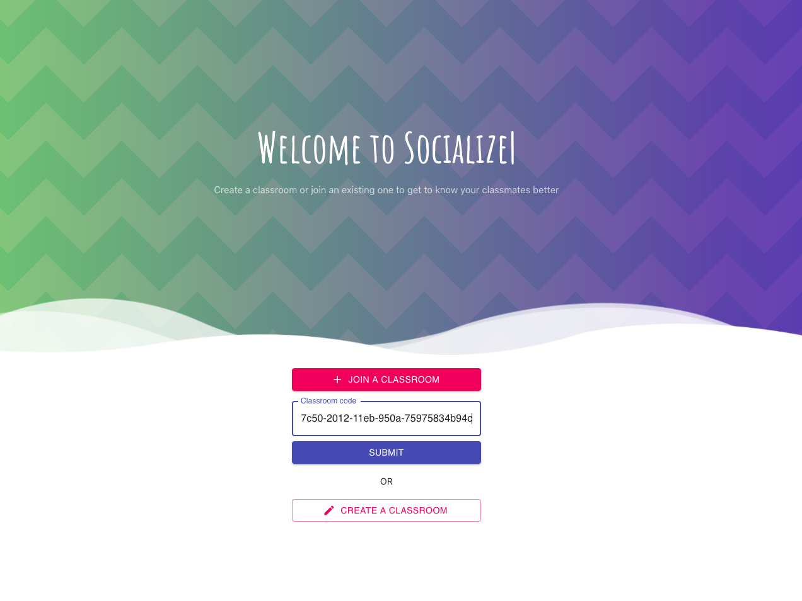
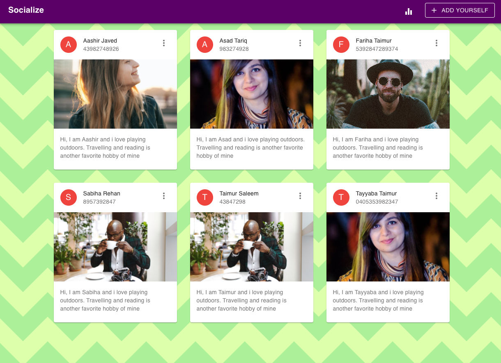

# Socialize
> A React application that lets you get to know your classmates better 

 

In remote classroom sessions, it is often difficult to introduce yourself to each of your classmates. Socialize is a handy tool where you can create or join a classroom and share the room code with your classmates who can all join in and post a little introduction of themselves.


## Installation


```bash
npm install
npm start
```

## Usage

You have an option to either join a classroom or create one. When you join an existing classroom, you will be able to see all people who are in that classroom and they have posted about themselves. 

You can join a classroom by inputting the room code

 

 Which will take you to the classroom it corresponds to


 


## Features

- Create a new classroom
- View and join an existing classroom
- Add a new person in a classroom
- View dummy data statistics through D3.js 

## Upcoming features

- View statistics with actual data
- Error handling
- Chat forums
- State management with Redux


## Tech Stack

- React
- Node.js
- Axios
- D3.js